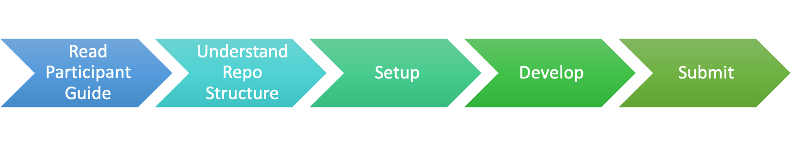

# Template Structure & Instructions

This template repository serves as a primer for hackathon participants to **setup**, **develop**, and **submit** qualified projects. 

## Repo File Structure

| File / Folder | Purpose |
| --- |  --- | 
| archive | Target folder for retaining original files during repo configuration process. |
| challenges | Collection of folders outlining setup criteria and instructions pertient to each event challenge.| 
| hackproject | Root project workspace folder for team artifacts. |
| submission-guides | Collection of preparatory and submission guides for using this repo. |
| FAQ.md | Collection of frequently asked questions related to Hackathon |
| HELP.md | Hacker's Guide for tools, sample use-cases. |
README.md | Default repo getting started instructions. |
SUBMISSION_README.md | Template README required for project submission. It replaces current README. |

## Setup

1. Read [FAQ](./FAQ.md) and [Hacker's Guide](./HELP.md)
2. Before configuring the project repository, get familiar with the configuration requirements for the preferred challenge:
    * [Challenge 1: Atomic Accessibility Design](./challenges/challenge1/setup.md)
    * [Challenge 2: Inclusive Contracts](./challenges/challenge2/setup.md)

## Develop

### Recommended Activity
1. [Attend suggested challenge (track) workshops](https://www.notion.so/tribegroup/Schedule-Events-a8fd71f103504b608946380c56e04c83)
2. [Team Brainstorming using Design Thinking Recipe](https://app.mural.co/template/a34cb087-9954-487a-810f-65671664f59d/97429e07-5ba1-47e9-91d3-98e668e51d42)
3. [Develop Use Case Story](./submission-guides/design-thinking-artifacts.md#developing-user-stories) based on findings from Design Thinking excercise. 

### Required Activity

1. Develop Playback Brief using [provided template](./challenges/common/presentations/gaad-hackathon-playback-template.pptx). *Hint: Leverage findings from Design Thinking to simplfy this task.*
2. Develop Concept Playback Pitch Video using the Playback Brief.
3. Develop solution code or optional prototype depending on requirements of challenge track. 
4. Develop Concept Show-n-tell video demonstrating working solution code in action.
5. Review and update GitHub Repo to ensure it is well structured and organized for judges.  
    
## Submit
The following steps are suggested for submitting a qualified event submission:

1. [Prepare repo for submission](./submission-guides/submission-instructions.md)
2. [Refer to Participant Guide Submission Process](https://www.notion.so/tribegroup/How-to-Submit-839ac3cdcdf24baf8785bbba206150e7)
