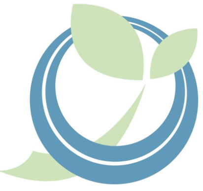
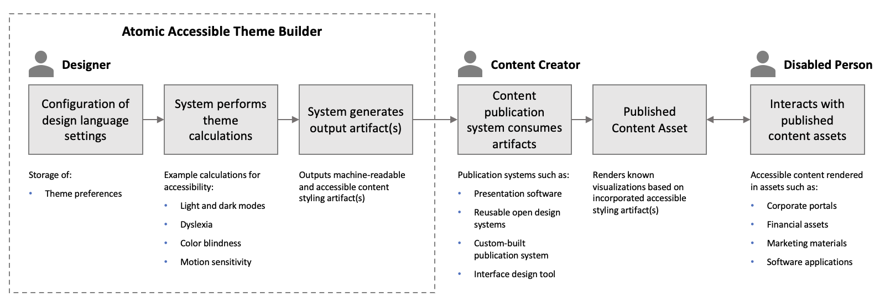
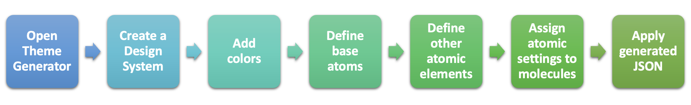
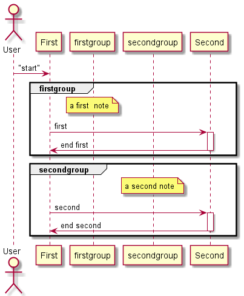

# Use Case Story Title

<!--- Template Instructions  
  Update the Story Title and remove the warning below.
--->

 Before submitting your project repo, modify template as desired and remove all inline  Template Instructions. 

<!--- Template Instructions  
  Organize TOC to meet needs or project
--->
#### Table of Contents
- [Use Case Story Title](#use-case-story-title) 
      - [Table of Contents](#table-of-contents)
  - [Acknowledgements](#acknowledgements)
  - [Business Challenge](#business-challenge)
    - [Concept](#concept)
    - [Approach](#approach)
  - [Vernacular](#vernacular)
  - [Assumptions](#assumptions)
  - [Persona](#persona)
  - [Story](#story)
  - [Demo Workflow](#demo-workflow)
    - [Step 1](#step-1)
    - [Step 2](#step-2)

 
## Acknowledgements

<!--- Template Instructions   
  List any acknowledgements pertaining to the concepts and resources used in this use case story.
--->

1. This scenario leverages a fictitious company called, _Acme Enterprise_. The  Acme Enterprise logo is borrowed from [Katie Wickens](https://steins_kake.artstation.com/projects/ebqgb), a graphics designer.
 
## Business Challenge
<!--- Template Instructions   
  Briefly describe the business challenge addressed by this use case story. Design Thinking exercises aid in the development of a clear problem statement. 
--->
 
### Concept
<!--- Template Instructions   
  Briefly describe how this use case applies Atomic Accessibility Design to the business challenge. Leverage Design Thinking exercises to aid in this endeavor. 
--->
 
### Approach
<!--- Template Instructions   
  Describe the end to end interactions of the stakeholders that are pertinent to this use case story. Leverage Design Thinking exercises to aid in this endeavor. 
--->

 
## Vernacular
<!--- Template Instructions   
  List and describe any terms that will be used in the story and referenced in diagrams. The current list provides a sample starter list. Leverage Design Thinking exercises to aid in the identification of use case archetypes. 
--->
 
1. **Impaired Person**: A content consumer with one or more disabilities or disorders. Needs to be able to interact with accessible content to achieve goals.
2. **Designer**: Defines consistent design language components and style. Needs to be able to create accessible styling for content creators and developers with minimal effort.
3. **Developer**: Implements design language in software systems that generate content. Needs to be able to create accessibly inclusive renderings with ease.
4. **Content Creator**: Utilizes the design language to produce consistently styled content. Needs to publish accessible content without extra steps or effort.
5. **Content Publishing System**: Any system that consumes artifacts from an accessible theme builder to produce physical or digital content that is accessibly compliant. 
 

## Assumptions
<!--- Template Instructions   
  List any assumptions to be considered in this use case story.  Leverage Design Thinking exercises to aid in this endeavor. 
--->
 
1. *Enter assumption text ...*
2. *Enter assumption text ...*
 
## Persona
<!--- Template Instructions   
  Using the sample persona images in the /images/persona folder, describe the roles of the entities involved in this use case story. The current list provides a sample starter list. 
--->
 
| Actor | Role | Goals | Details |
| --- | --- | --- | --- |
|  | Financial Institution, Content Creator | Generate accessibly complaint content. |  |  
|   Acme Enterprise |  |  |  |
|  Angelica | Designer |  |  | |
|  Darius | Impaired Person |  |  | |
|  Atomic Accessibility Design Tool | Theme Builder |  | |
 
## Story
<!--- Template Instructions   
  Using the sample persona images in the /images/persona folder, describe the steps that are involved in the interactive use case story. The story below is offered as an exemplar.
--->

 Acme Enterprise has been contracted by  to provide accessible themes.  Angelica uses a theme builder to generate a theme for  Darius. 

1.  Angelica opens Theme Building Tool.
2.  Angelica creates a new design system project within the Theme Building Tool.
3.  Angelica configures project to produce themes that are either Business (AA) or Government (AAA) [WCAG Compatible][WCAG].
4.  Angelica adds 10 shades of a color in light and dark mode with corresponding "on color" to the project.
5.  Angelica defines the base atoms for the theme. This lays the foundation for all light and dark mode calculations. The Theme Building Tool guides  Angelica through the following steps that **must** occur in sequential order:

   1. Select Primary, Secondary, and Tertiary Colors
   2. Define Light mode background and dark mode background.
   3. Define Gradient backgrounds, Buttons and Icons colors, and Gradient Text.

6.  Angelica defines other atomic elements (atoms, molecules) that will be used by the theme. The Theme Building Tool guides  Angelica through the following steps:

   1. Data independent preferences
      1. Specify minimum desktop target area
      2. Specify grid system
      3. Specify animation settings
   2. Data dependent preferences using decisions associated with Primary, Secondary, Tertiary, Light and Dark Mode background colors. These attribute values are calculated:
      1. state colors
      2. Fonts / Typography
      3. Default Border Settings
      4. Elevations
      5. Bevels
      6. Chart colors

7.  Angelica applies atomic settings to molecules associated with the theme project.
8.  Angelica uses the Theme Building Tool to generate theme asset types (JSON, CSS, design tokens).
 
## Demo Workflow
<!--- Template Instructions   
  Using the sample persona images in the /images/persona folder, describe the steps of the use case story as they relate to one or more UML Sequence Diagrams.  
--->
 
### Step 1
 Darius conveys impairment preferences to  Angelica.
 

 
### Step 2
 
 Angelica uses  Atomic Accessibility Design Tool to generate a theme. 
 

 