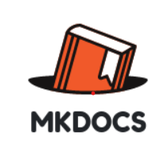
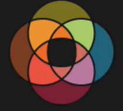
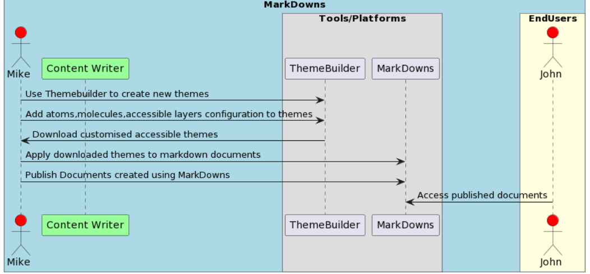

# Theme builder extensions for Content writters (mkdocs/docsaurus)

#### Table of Contents
- [ Theme builder extensions for Content writters (mkdocs/docsaurus) ](#Content Generator  )
  - [Table of Contents](#table-of-contents)
    - [Acknowledgements](#acknowledgements)
    - [Business Challenge](#business-challenge)
        - [Concept](#concept)
        - [Approach](#approach)
    - [Vernacular](#vernacular)
    - [Assumptions](#assumptions)
    - [Persona](#persona)
    - [Demo Workflow](#todo)    
    - [Benefits](#benefits)
  

## Acknowledgements

1. Finos Hackathon team for this opportunity and great planning.
2. Discover Finanical Services,AngelHack,AXA ,Mural for their support.

## Business Challenge

Generate contents meeting accessibility standards.
Making daily content work accessible and become well-versed in digital accessibility standards.

### Concept
By leveraging the themes generated by Theme builder ,content generators can create document more accessible and reach out to wide class of people.

This eliminates manually generating those themes , Make all segments of people content creators.

### Approach
Project-(Theme builder extensions for Content writters (mkdocs/docsaurus)) - content creators with disabilities can use themes generated using theme builders and apply those themes in documentation platforms like Mkdocs/Docusarus and create more accessible documents.

The goal is to demonstrate the end-to-end activities necessary to:

* Content creators can create customised themes which are having accessiblity related css changes.
* Content creators can download those themes and apply across documentation platforms/Tools .
* Make contents available for all class of people.
* Discover will acheieve diversity and inclusion goals.

## Vernacular

1. **Discover Financial Services**: A financial institute wants to acheive diversity and inclusion goals.
2. **Content Writters**: Person with disability want to create accessible contents.
3. **Theme Builder**: Platform for generating customised accessible themes.
4. **Documentation Platoform/Tools**: Tools used for generating documents.
5. **End Users**: People with disabilities.

## Assumptions

1. Use case assumes knowledge of the W3C accessible Standards 
2. Modified accessible contents are readily available for class of peoples.

## Persona

| Actor                                                                        | Role | Goals                                                                                                                          | Details                                                                                                                                                             |
|------------------------------------------------------------------------------| --- |--------------------------------------------------------------------------------------------------------------------------------|---------------------------------------------------------------------------------------------------------------------------------------------------------------------|
|    John Doe           | Content Writter | Create documents                                                  | uses documentation tools/platforms to generate new documents  .                                                          |
|    Mike Doe           | End-user | acess the contents created by content creator and can be impaired worker/person | uses documentation tools/platforms to access new.                                                          |
|   Discover   | financial services | employs disabled content writers. | achieve diversity and inclusion goals. |
|    Documentation Tool  | Platforms | Platform/Tools used by content creators to create new documents.| helps contenet creators to create documemnts and reach out to all clss of peoples.|
|    Theme Builder Tool  | Platforms | Platform/Tools used by content creators to create new themes.| helps contenet creators to create new themes and css configurations for documents.|

## Demo Workflow

## Benefits
1. Generated themes can be applied across many documentation platforms and tools.
2. Make all segments of people content creators 
3. helps to achieve DEI (diversity, equity and inclusion), ) goals.
