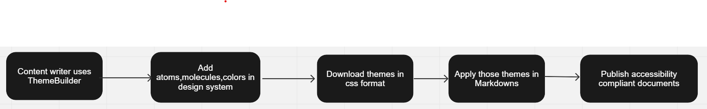

# Theme builder extensions for MarkDowns (mkdocs/docsaurus)

  - [Table of Contents](#table-of-contents)
    - [Acknowledgements](#acknowledgements)
    - [Business Challenge](#business-challenge)
        - [Concept](#concept)
        - [Approach](#approach)
    - [Vernacular](#vernacular)
    - [Assumptions](#assumptions)
    - [Persona](#persona)
    - [Story](#story)
    - [Demo Workflow](#todo)    
    - [Benefits](#benefits)
  

## Acknowledgements

1. Finos Hackathon team for this opportunity and great planning.
2. Discover Finanical Services,AngelHack,AXA ,Mural for their support.

## Business Challenge

Web based applications like Mkdocs, Docusaurus is used to create and share documents in Markdown format. 
It was designed to be simple and intuitive, with a user-friendly interface that made it easy for anyone to create beautiful documents.
Hence, it is popular with writers, bloggers, and developers who loved the simplicity and flexibility of the Markdown format. 

However, users with accessibility needs have trouble accessing the application due to accessibility issues.

Some users reported that the application's color scheme made it difficult for them to read the text, while others found it hard to navigate the interface using assistive technologies like screen readers. 
In addition, some users with motor impairments struggled to use the application's keyboard shortcuts, which were not customizable.

Few tried to address the accessibility issues by making small adjustments to the application design and functionality.

Here we take up comprehensive solution to solve the business challenge of solving the accessibility issues by using Theme Builder's accessibility compatible themes in Markdown pages. 

### Concept
Theme Builder, is addressing accessibility issues in web design by providing a range of accessibility compatible themes for web pages builders. 
Our concept is to extend the themes provided by Theme Builder for Markdown pages to meet the needs of all users, including those with disabilities or impairments.

### Approach
To address accessibility issues faced by users of Markdown pages, we have developed a comprehensive approach that incorporates the following steps:

1. Content creators can create customised themes which are having accessibility related css changes.
2. Content creators can download those themes and apply across documentation platforms/Tools .
3. Make contents available for all class of people.

## Vernacular

1. **Company X**: A financial institute wants to achieve diversity and inclusion goals.
2. **Content Writers**: Person with accessibility needs who want to create accessible contents.
3. **Theme Builder**: Platform for generating customised accessible themes.
4. **Documentation Platform/Tools**: Tools used for generating documents.
5. **End Users**: All groups of people including people with accessibility needs.

## Assumptions

1. Use case assumes knowledge of the W3C compliant accessible Standards 
2. Modified accessible contents are readily available for class of peoples.

## Persona

| Actor                                                                                 | Role | Goals                                                                                     | Details                                                                            |
|---------------------------------------------------------------------------------------| --- |-------------------------------------------------------------------------------------------|------------------------------------------------------------------------------------|
|    Mike Doe                    | Content Writter | Create documents                                                                          | Uses documentation tools/platforms to generate new documents  .                    |
|    John Doe                    | End-user | Access the contents created by content creator and can be person with accessibility needs | Uses documentation tools/platforms to access new.                                  |
|  Company X                                                                         | financial services | Employs people with  accessibility needs as content writers.                              | Achieve diversity and inclusion goals.                                             |
|    Documentation Tool   | Platforms | Platform/Tools used by content creators to create new documents.                          | Helps content creators to create documemnts and reach out to all class of peoples. |
|    Theme Builder Tool | Platforms | Platform/Tools used by content creators to create new themes.                             | Helps content creators to create new themes and css configurations for documents. |

## Story

1.  Mike uses  Theme Building Tool.
2.  Mike onboard a new design system within the Theme Building Tool.
3.  Mike adds atoms,molecules,colors,accessible layers configurations in design system
4.  Mike generates those design themes in css format
5.  Mike downloads those design themes.

6.  Mike applies downloaded themes to markdown documents created using 
7.  Mike will verify document for accessiblity compliance.
8.  Mike publishes  documents ,   John access the published documents.

## Demo Workflow

## Benefits
By using Theme Builder's accessibility-compatible themes for Markdown pages, users can ensure that their documents are fully accessible to all, regardless of their abilities. Our themes incorporate features such as high contrast modes, clear and readable fonts, and keyboard navigation support, making it easier for users with visual, auditory, and motor impairments to access and use their content.

In addition, our themes are fully customizable, allowing users to choose the colors, fonts, and layouts that work best for them. This customization ensures that each user's experience is tailored to their specific needs and preferences.

By solving accessibility issues with Markdown pages, users can create and share documents in a way that is more inclusive and user-friendly, reaching a broader audience and ensuring that everyone can benefit from their content. With Theme Builder's accessibility-compatible themes for Markdown pages, users can achieve their goals while promoting accessibility and inclusivity.