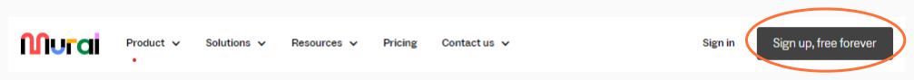
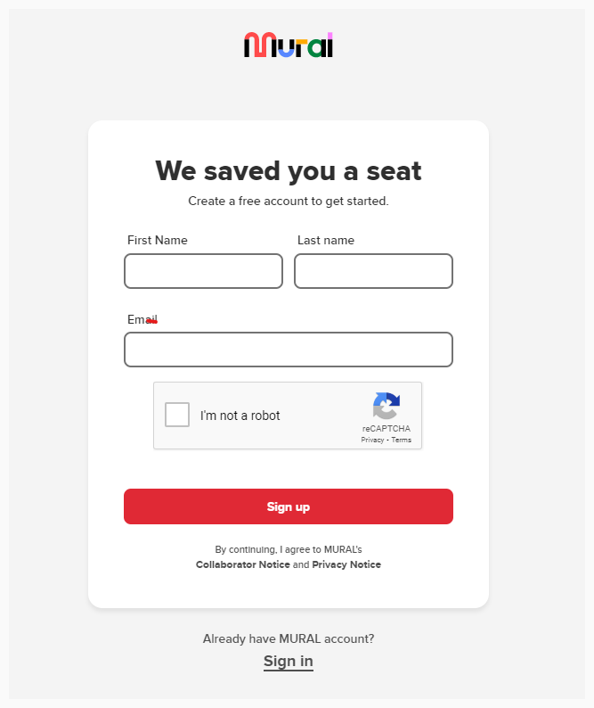
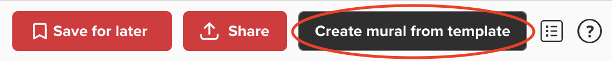
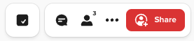
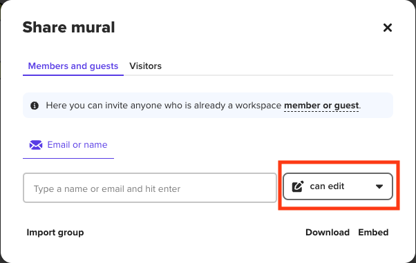
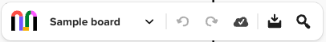
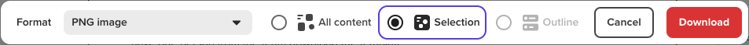

# Mural Instructions 

## Creating a Mural Account 
(**NOTE:** if you already have a mural account, please skip this step and simply login)
1. Go to [Mural](mural.co) 
2. Create a free account by selecting, "sign up, free forever"
3. Provide your First Name, Last Name, & Email Address to sign up as a free member. 

# Mural Template Instructions

Note: You only need one person from the team to download the template. Once that one member has the template, they can share it with the rest of their team. 

## Using the Template
1. Use [this link](https://app.mural.co/template/a34cb087-9954-487a-810f-65671664f59d/97429e07-5ba1-47e9-91d3-98e668e51d42) to navigate to the GAAD Hackathon Mural template.
2. Select, "Use this template"
3. Click, "Create Mural from Template"
4. NOTE: If you have not created a Mural account yet, you will be prompted to do so.
  
  
  
5. Once you have the template open in your workspace, be sure to name it by selecting the default title, "untitled" in the upper left.
6. Click "share" to share the workspace with your Hackathon team.
  
  
  
7. Copy the link provided - ensure all workspace members with the vistor link, "can edit". 

  

## Exporting Your Work
1. Once you are completed with your work, please export to either a PDF or PNG by selecting, "download". (HINT: if you are downloading an image for a Playback Brief, a PNG might be easiest.)
  
  
  
2. Select the area you'd like to export by selecting the button "selection" 
  
  
  
3. Upload image to your project's repo. 
